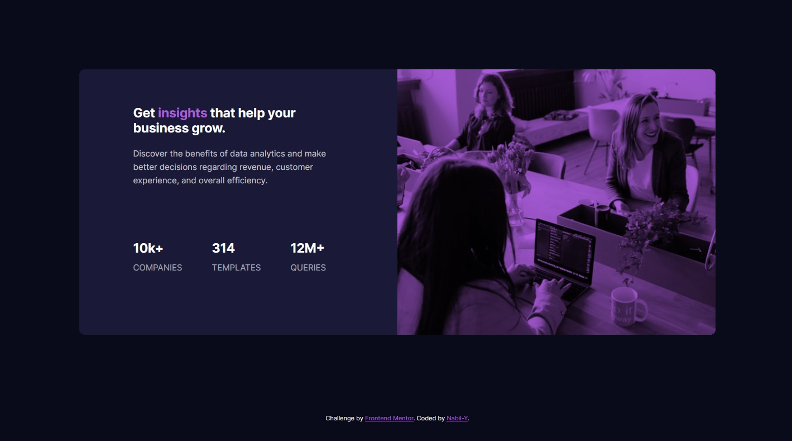
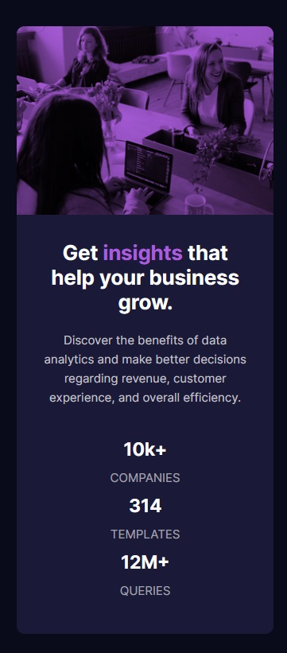

# Frontend Mentor - Stats preview card component solution

This is a solution to the [Stats preview card component challenge on Frontend Mentor](https://www.frontendmentor.io/challenges/stats-preview-card-component-8JqbgoU62). Frontend Mentor challenges help you improve your coding skills by building realistic projects. 

## Table of contents

- [Overview](#overview)
  - [The challenge](#the-challenge)
  - [Screenshot](#screenshot)
  - [Links](#links)
- [My process](#my-process)
  - [Built with](#built-with)
  - [What I learned](#what-i-learned)
  - [Continued development](#continued-development)
- [Author](#author)

## Overview

### The challenge

Users should be able to:

- View the optimal layout depending on their device's screen size

### Screenshot

### Links

[Live Preview](https://nabil-y.github.io/StatsPreviewChallenge/)

## My process

### Built with

- Semantic HTML5 markup
- CSS custom properties
- Flexbox
- Responsive Design

### What I learned

- I have more experience with flexbox and responsive design
- How to use blend properties in CSS
- Putting to use the advice received after completing my first project like using border-box property

### Continued development

- I need to practice more and more with Flexbox and responsive design.

I feel pretty good about this project because it took me way less time than the first.

## Author

- Frontend Mentor - [@Nabil-Y](https://www.frontendmentor.io/profile/Nabil-Y)

